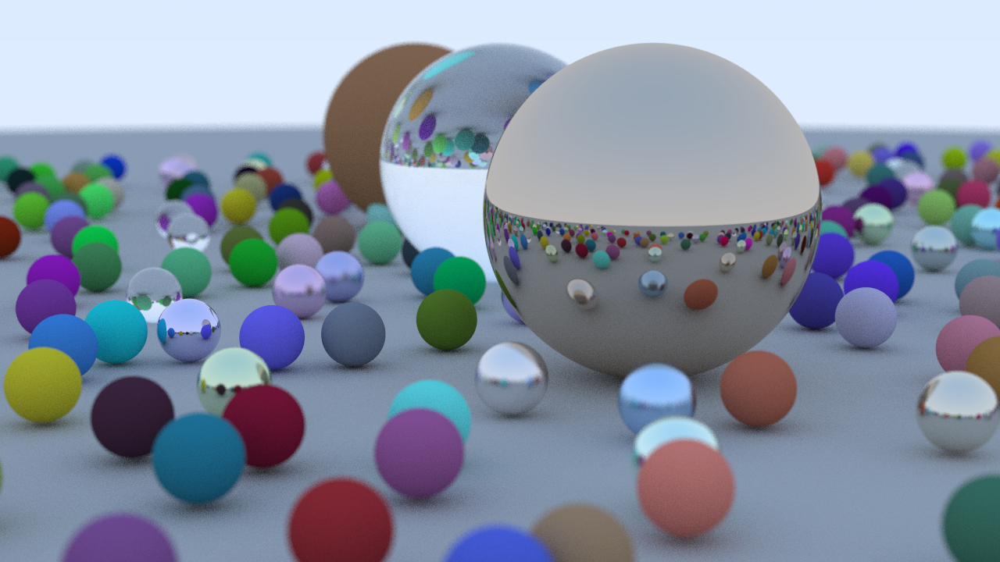

# Ray tracing in one weekend

This is a Rust implementation of [Peter Shirley's "Ray Tracing in One Weekend"](https://raytracing.github.io/books/RayTracingInOneWeekend.html).

The dependencies are:
- [`rand`](https://crates.io/crates/rand)
- [`rayon`](https://crates.io/crates/rayon)

Here is a high-resolution render of the final scene:

